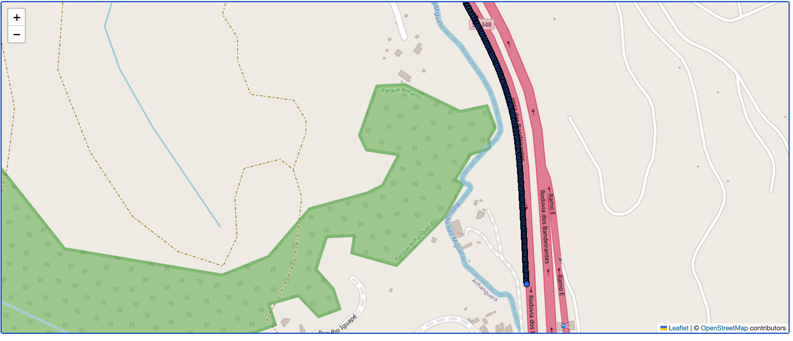
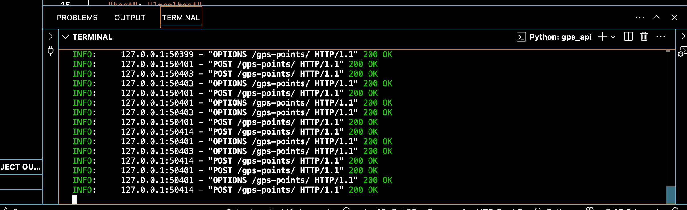

# GPS Map Backend API

This project provides a backend API for serving GPS points for a map-based frontend. The API supports spatial filtering by bounding box and zoom level, enabling efficient rendering of map data and road distress points only within the visible area.

## Features
- **POST API** to fetch GPS points within a bounding box and zoom level
- **GeoJSON** output for easy integration with mapping libraries
- **Zoom-level filtering** to reduce clutter and highlight road distresses
- **PostGIS**-enabled PostgreSQL database for spatial queries

---

## Setup Instructions

1. **Clone the repository**
2. **Install dependencies** (Python 3.8+ recommended):
   ```bash
   python -m venv .venv
   source .venv/bin/activate
   pip install fastapi uvicorn psycopg2 pydantic
   ```
3. **Set up PostgreSQL with PostGIS**
   - Create a database and enable PostGIS extension
   - Import your GPS data into a table named `gps_points` (see `create_gps_table.sql` for schema)
4. **Configure database connection**
   - Edit `gps_api.py` and update the `db_params` dictionary with your DB credentials
5. **Run the API server**
   ```bash
   uvicorn gps_api:app --host 0.0.0.0 --port 8080
   ```

---

## API Usage

### Endpoint
`POST /gps-points/`

### Request Body (JSON)
```
{
  "min_lat": float,
  "min_lng": float,
  "max_lat": float,
  "max_lng": float,
  "zoom_level": int
}
```

### Response (GeoJSON FeatureCollection)
```
{
  "type": "FeatureCollection",
  "features": [
    {
      "type": "Feature",
      "geometry": { "type": "Point", "coordinates": [lng, lat] },
      "properties": {
        "frame_number": ...,
        "frame_time": ...,
        "group_id": ...,
        "group_order": ...,
        "lat": ...,
        "lng": ...,
        "millis": ...,
        "speed": ...,
        "video_index": ...,
        "point_type": "Normal" or "Speeding"
      }
    },
    ...
  ]
}
```

### Example `curl` Request
```
curl -X POST "http://localhost:8080/gps-points/" \
  -H "Content-Type: application/json" \
  -d '{"min_lat":12.9,"min_lng":77.5,"max_lat":13.0,"max_lng":77.6,"zoom_level":15}'
```

---

## Frontend Integration
- The frontend should track the map's current bounding box and zoom level.
- On map move or zoom, send a POST request to `/gps-points/` with the current bounding box and zoom.
- Render the returned GeoJSON points on the map, using the `point_type` property for styling if desired.

---

## Snapshots

Below are example snapshots from the frontend:







---

## Haniya 2025
